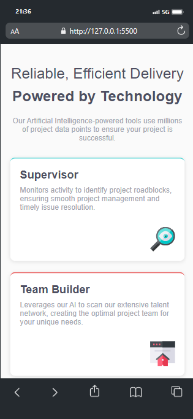

# Frontend Mentor - Four card feature section solution

This is a solution to the
[Four card feature section challenge on Frontend Mentor](https://www.frontendmentor.io/challenges/four-card-feature-section-weK1eFYK).
Frontend Mentor challenges help you improve your coding skills by building
realistic projects.

## Table of contents

- [Overview](#overview)
  - [The challenge](#the-challenge)
  - [Screenshot](#screenshot)
  - [Links](#links)
- [My process](#my-process)
  - [Built with](#built-with)
  - [What I learned](#what-i-learned)
  - [Continued development](#continued-development)
  - [Useful resources](#useful-resources)
- [Author](#author)
- [Acknowledgments](#acknowledgments)

## Overview

### The challenge

Users should be able to:

- View the optimal layout for the site depending on their device's screen size

### Screenshot


.png>)

### Links

- Solution URL:
  (https://github.com/Mubarak-Adeyemi/four-card-feature-section-master)
- Live Site URL:
  (https://mubarak-adeyemi.github.io/four-card-feature-section-master/)

## My process

### Built with

- Semantic HTML5 markup
- CSS custom properties
- Flexbox
- CSS Grid
- Mobile-first workflow

### What I learned

In this project, I learned to effectively use CSS Grid for building responsive
layouts. I also gained a better understanding of media queries, ensuring my
design adapts well to different screen sizes. Here’s a sample of my media query
implementation:

```css
@media (min-width: 769px) {
  .tools-grid {
    grid-template-columns: repeat(3, 1fr);
    grid-template-rows: repeat(2, 1fr);
    grid-template-areas:
      "supervisor team-builder calculator"
      "supervisor karma calculator";
    align-items: center;
  }
}
```

### Continued development

I aim to continue improving my understanding of responsive design principles and
CSS Grid layouts. In future projects, I plan to explore more advanced animations
and further optimize layouts for smaller devices.

### Useful resources

- [CSS Tricks - A Complete Guide to Grid](https://css-tricks.com/snippets/css/complete-guide-grid/) -
  This is an amazing article that thoroughly explains CSS Grid, and it helped me
  implement the layout in this project.
- [Automatic CSS Documentation on Text & Heading Line Length](https://automaticcss.com/docs/text-heading-line-length/#:~:text=CSS%2Dbased%20line%20length%20caps&text=We%20do%20this%20by%20setting,it%27s%20more%20or%20less%20accurate.) -
  This resource helped me better understand text and heading length limitations
  and best practices.

## Author

- Frontend Mentor -
  [@Mubarak-Adeyemi](https://www.frontendmentor.io/profile/Mubarak-Adeyemi)
- Twitter -
  [@mubaraElarabiy](https://x.com/mubarakElarabiy?t=dIaedCkOJLk9K0-tB1tS9w&s=09)

## Acknowledgments

A big thanks to the Frontend Mentor community for providing insightful feedback
that helped improve my solution. I also found inspiration from other solutions
to the same challenge, which enhanced my learning.
